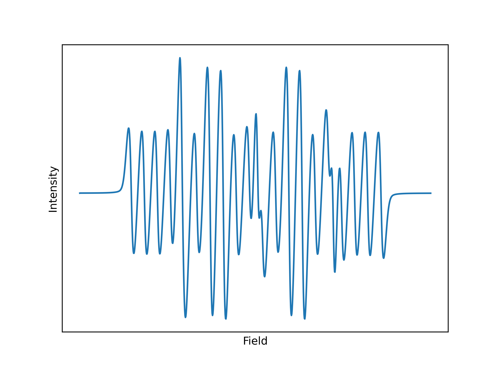

# OxEsrafel

Oxidized Esrafel, cioè le Python bindings per LibEsrafel, un toolbox per la manipolazione di spettri EPR/ESR.
Queste bindings nascono per facilitare l'impiego delle funzioni di Esrafel all'interno di script Python.
Ad esempio, in questo modo, è possibile caricare i risultati delle simulazioni e plottarli direttamente con Matplotlib.
Oppure, si possono sottoporre i risultati a delle elaborazioni effettuate con NumPy, SciPy ed altre librerie scientifiche dell'ecosistema Python, il tutto senza sacrificare i vantaggi di Rust per la scrittura delle funzioni fondamentali. Potrebbero anche essere scritte delle GUI dedicate attraverso Python, anche se al momento gli sforzi sono diretti verso lo sviluppo di un'app in GTK4 direttamente in Rust.

La cartella test è un ottimo posto da cui cominciare per esplorare quel che si può fare con OxEsrafel.

## IO
<!-- (Qui ci vuole un diagramma, è più facile da leggere) -->
- Importare spettri da ASCII
- Importare parametri da SIM (direttamente compatibili con la classe `Simulator`)
- Importare parametri da SIM come Dictionary (TODO, attraverso loading da JSON)
- Esportare spettri come JSON
- Esportare parametri come JSON

Sfruttando altre librerie python, è quindi facile convertire successivamente i parametri JSON.

## Simulazione
Creare e variare parametri di radicali e relativi nuclei direttamente da Pyhon.

## Plotting
Attraverso matplotlib o altre librerie, è possibile:
- Visualizzare i risultati del calcolo a partire dai parametri importati
- Visualizzare lo spettro sperimentale a partire dai parametri importati

Vedi altre immagini d'esempio in `tests/img`.
